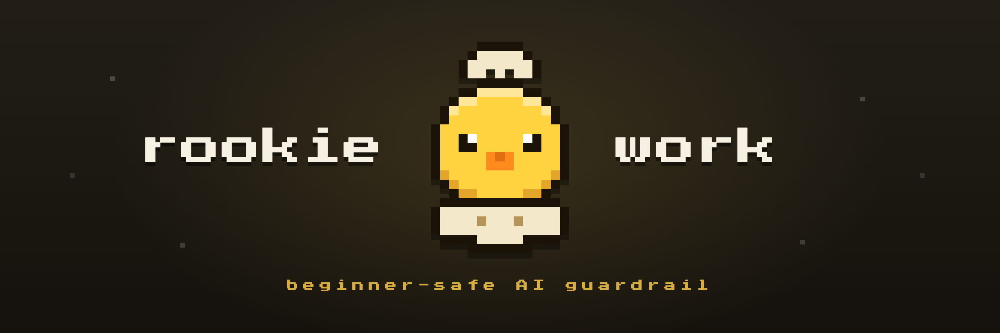

<p align="center">
  
</p>

# rookie-work

**English** | [简体中文](./README.zh-CN.md)

> A beginner-safe workflow guardrail for AI coding agents — Claude Code, Codex, and Hermes.
> The agent never changes anything of yours before telling you, in plain language you understand, what it's about to do and how — and getting your OK.

## Why you need it

AI coding agents are powerful — which is exactly the problem when you're new to them. They move fast, make decisions you never saw, and sound confident even when they're wrong. If you don't read code fluently, you can't catch any of it. **rookie-work puts you back in control:** it makes the agent work like a careful senior engineer who explains everything in plain language and never acts behind your back.

Everyday problems it fixes:

| Without rookie-work | With rookie-work |
| --- | --- |
| The agent **quietly picks** an approach, library, or design — and you find out it went the wrong way only after it's built. | Every real choice is laid out in plain language with pros, cons, and a recommendation. **You** decide — nothing is settled silently. |
| It **changes or deletes things you never asked about** ("while I was in there I improved X") and breaks something else. | Before any change, it tells you what it will do and how, and waits for your OK. If the work grows beyond the plan, it stops and asks. |
| **Trivial things get over-engineered; risky things get rushed.** | Three tiers right-size the effort — a lookup just happens, a small edit gets a quick check, a real feature gets the full flow. |
| It announces **"done!"** without ever running or testing anything. | "Done" means it **showed you it working** — ran it, tested it, pointed at the evidence. |
| You have an idea but **don't even know how to start the conversation** — you can't turn it into a clear brief. | It offers to build the plan *with* you first, in plain language, one decision at a time, so you understand and own what you're building before any code. |

## How it works

rookie-work sizes every task into one of three tiers, so small things stay quick and risky things get care:

- **Tier 0 — just do it.** Read-only: a lookup, finding a file, explaining code. Nothing changes, so there's no fuss.
- **Tier 1 — light.** A small, low-risk change with one obvious way to do it. The agent says what it'll do, you confirm, it does it, it reports back.
- **Tier 2 — full.** Real choices, lots of impact, or hard to undo. The agent runs the full flow: understand the project → work out the boundaries with you → design → plan → build → check it actually works.

It turns **on automatically** the moment you install it — the discipline loads at the start of every session — and it always replies in **your** language.

## Install

> **Simplest of all — hand it to your agent.** Copy this repo's link — `https://github.com/xuzheng1210/rookie-work` — paste it to the Claude Code, Codex, or Hermes you already use, and ask it to **help you install this plugin and walk you through the setup, one step at a time.** Prefer to do it yourself? Follow the steps below.

rookie-work runs on three agents. **Not sure which you have? Pick Claude Code — it's the easiest, and you don't need to open anything technical.** The off-switch at the end works the same on all three.

### Claude Code — easiest, no terminal needed

You type these commands **inside Claude Code itself** — in the same box where you chat with it. Exactly the same on Windows and Mac.

1. Open Claude Code.
2. Type this line and press **Enter**:
   ```text
   /plugin marketplace add https://github.com/xuzheng1210/rookie-work
   ```
3. Then type this line and press **Enter**:
   ```text
   /plugin install rookie-work@rookie-work-marketplace
   ```

That's it — rookie-work is on, and it starts working automatically in every new session. Later, to get the newest version, type `/plugin marketplace update`.

### Codex

For Codex you type commands in a **terminal** — a window where you type instructions. First, open one:

- **On Windows — open PowerShell:** press the **Windows key**, type `powershell`, and press **Enter**. A blue window opens. (The older `cmd` works too — the commands are the same.)
- **On Mac — open Terminal:** press **⌘ Command + Spacebar**, type `Terminal`, and press **Enter**. A small window opens.

**Step 1 — install rookie-work.** In that window, type these two lines, pressing **Enter** after each (same on Windows and Mac):

```text
codex plugin marketplace add xuzheng1210/rookie-work
codex plugin add rookie-work@rookie-work-marketplace
```

rookie-work is now usable any time by typing `$rookie-work`. **If that's enough for you, you're done.** To have its guardrails start automatically, do Step 2.

**Step 2 — review and trust the bundled hooks (optional, recommended).** rookie-work already includes both hooks it needs: `SessionStart` loads the full method when a task starts, and `UserPromptSubmit` restores the short decision gate on every prompt. Do not create a separate hook configuration.

1. Start or restart Codex after installing the plugin.
2. Inside Codex, type `/hooks`.
3. Find the hooks bundled with `rookie-work`, review their commands, then trust and enable both `SessionStart` and `UserPromptSubmit`.
4. Start a new task so the trusted hooks can take effect from the beginning.

Codex records trust for the exact hook definition. After you update rookie-work, open `/hooks` again and review any new or changed hooks before starting the next task.

**Migrating from the older manual setup:** if you previously added a rookie-work `SessionStart` entry to your user hook file (`%USERPROFILE%\.codex\hooks.json` on Windows or `~/.codex/hooks.json` on Mac), remove that old rookie-work entry before trusting the bundled hooks. Keeping both sources would run both copies and inject the same startup guidance twice.

### Hermes

Hermes is the most hands-on of the three — pick it only if you already use Hermes. Open the right window first:

- **On Mac**, open **Terminal** (⌘ Command + Spacebar, type `Terminal`, Enter).
- **On Windows**, Hermes runs inside **WSL** (a Linux system that lives inside Windows). If you've never set up WSL, Hermes probably isn't your best starting point — use Claude Code instead. If you already have WSL, open its window.

In that window, type these lines (press **Enter** after each). They download rookie-work and put its files where Hermes looks for them:

```text
git clone https://github.com/xuzheng1210/rookie-work
cd rookie-work

mkdir -p ~/.hermes/skills ~/.hermes/agent-hooks
cp -R dist/hermes/skills/rookie-work ~/.hermes/skills/
cp dist/hermes/agent-hooks/rookie-work-inject.sh dist/hermes/agent-hooks/SESSION-PREAMBLE.md dist/hermes/agent-hooks/PROMPT-GATE.md ~/.hermes/agent-hooks/
chmod +x ~/.hermes/agent-hooks/rookie-work-inject.sh
```

Finally, open the file `~/.hermes/config.yaml` in a text editor and add these lines (if it already has a `hooks:` line, put just the `pre_llm_call:` part underneath it):

```yaml
hooks:
  pre_llm_call:
    - command: "~/.hermes/agent-hooks/rookie-work-inject.sh"
      timeout: 10
```

Start Hermes — type `/rookie-work` to use it, and it greets you automatically each session. The first time it asks `Allow this hook to run? [y/N]`, type `y` and press **Enter**.

## Turn it off

- **Easiest — just ask:** tell the agent "turn off rookie-work" (or "give me raw mode") and it stands down for the session; say "turn it back on" to resume. Ask it to "turn off rookie-work permanently" and it creates the file below for you (telling you first).
- **By hand, permanently:** create an empty file named `.rookie-work-off` in your home folder to turn it off everywhere, or in one project's folder to turn it off there only. Delete the file to turn it back on.

This works the same on Claude Code, Codex, and Hermes.

## Language

rookie-work talks to you in **your** language — whatever you write in, it answers in. These docs ship in English and 简体中文; the method files are in English for portability.

## Status

**v1.1.0** — adds a framing & boundary-finding front-stage to Tier 2 (helps people new to development turn a vague idea into a clear, owned plan before any code is written). v1.0.0 was the first public release. Design and implementation notes live in `docs/`.

## License

MIT © 2026 xuzheng1210
